## Hello! I'm Paul, a [Teesside University](https://www.tees.ac.uk) and [Code Institute](https://codeinstitute.net/global/) graduate. 👋🏻

### Projects

<a href="https://github.com/paulio11/P2-Co-op-Your-Pay">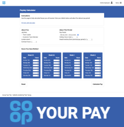</a>
<a href="https://github.com/paulio11/P3-Hangman-Python-Terminal-Game">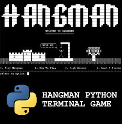</a>
<a href="https://github.com/paulio11/P4-Squigl-Twitter-Clone">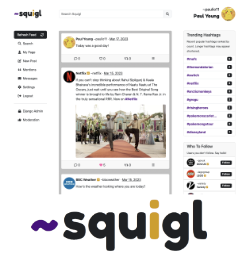</a>
<a href="https://github.com/paulio11/P5-Pokebox">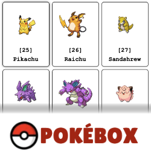</a>
<a href="https://github.com/paulio11/P5-Pokebox-API">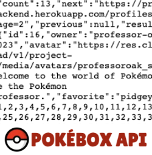</a>
<a href="https://github.com/paulio11/Co-op-Today">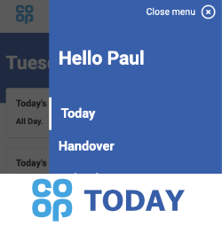</a>
<a href="https://github.com/paulio11/Co-op-Today-React">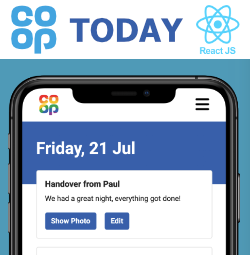</a>
<a href="https://github.com/paulio11/banana">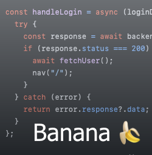</a>
<a href="https://github.com/paulio11/squigl-react">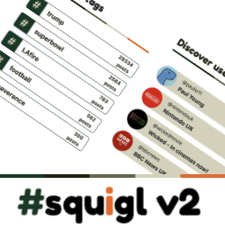</a>
<a href="https://github.com/paulio11/pixel-paint">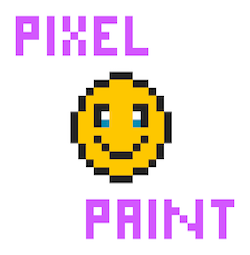</a>
<a href="https://github.com/paulio11/Short-Story-Thing">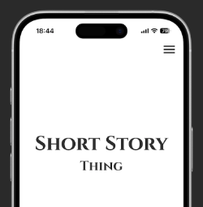</a>

 

<!--
**paulio11/paulio11** is a ✨ _special_ ✨ repository because its `README.md` (this file) appears on your GitHub profile.

Here are some ideas to get you started:

- 🔭 I’m currently working on ...
- 🌱 I’m currently learning ...
- 👯 I’m looking to collaborate on ...
- 🤔 I’m looking for help with ...
- 💬 Ask me about ...
- 📫 How to reach me: ...
- 😄 Pronouns: ...
- ⚡ Fun fact: ...
-->
